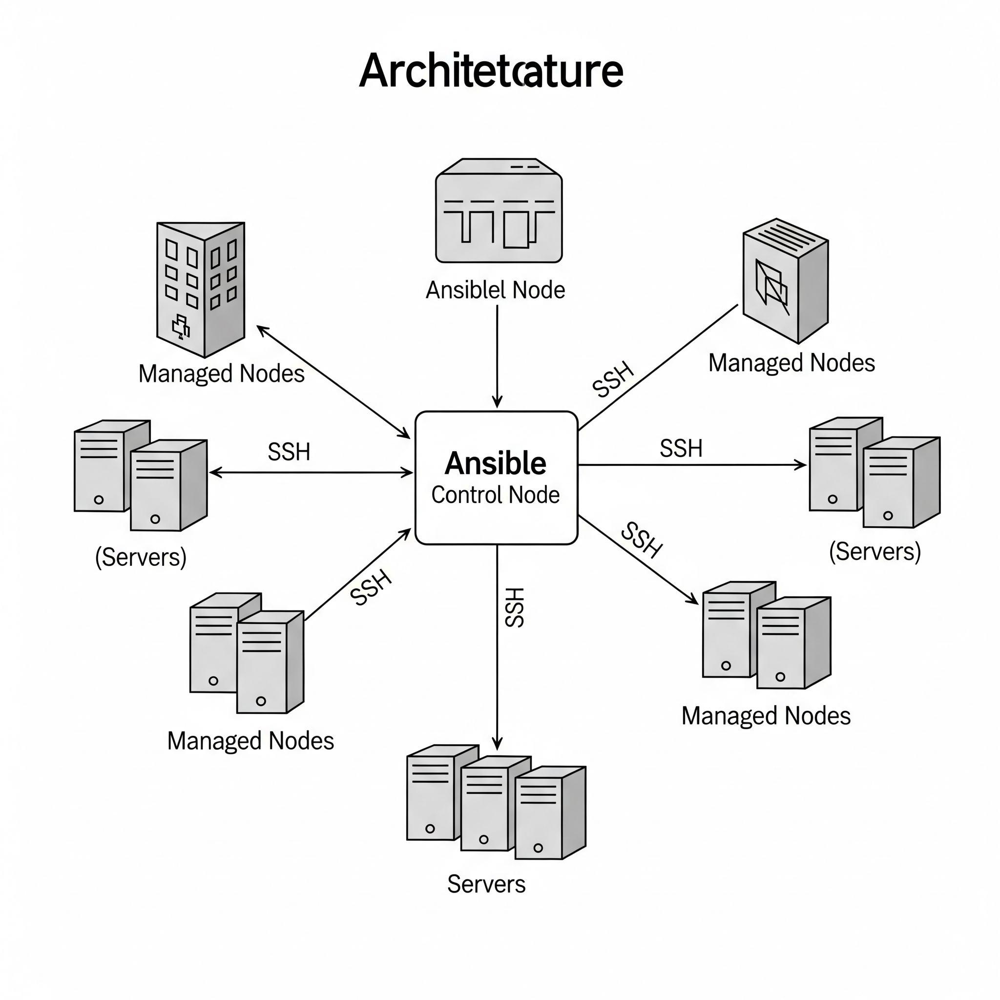

# Introduction to Ansible

## What is Ansible?

Ansible is an open-source IT automation tool used for configuration
management, application deployment, provisioning, orchestration, and
task automation. It helps system administrators and DevOps teams manage
complex IT environments with ease.

## Key Features of Ansible

-   **Agentless**: Ansible does not require agents or daemons to be
    installed on target machines. It uses SSH or WinRM for
    communication.
-   **Simple YAML Syntax**: Uses human-readable YAML files (playbooks)
    to define automation tasks.
-   **Idempotent**: Ensures that repeated executions of tasks do not
    make unintended changes.
-   **Cross-platform**: Supports Linux, Windows, cloud providers (AWS,
    Azure, GCP), containers, and networking devices.

## Ansible Architecture



1.  **Control Node**: The system where Ansible is installed and from
    which automation tasks are executed.
2.  **Managed Nodes**: The servers, cloud instances, or devices that are
    managed by Ansible.
3.  **Inventory**: A list of managed nodes defined in a file (usually
    `hosts`).
4.  **Modules**: Reusable units of code that perform specific tasks
    (e.g., package installation, file management).
5.  **Playbooks**: YAML files containing sets of instructions for tasks.
6.  **Plugins**: Extend Ansible functionality (e.g., connection types,
    callbacks, lookups).


## How Ansible Works

1.  Ansible connects to managed nodes using SSH (Linux/Unix) or WinRM
    (Windows).
2.  Executes modules or tasks defined in the playbook.
3.  Collects results and ensures tasks are idempotent.
4.  Provides output of execution to the user.

## Advantages of Ansible

-   Easy to learn and use.
-   No need for additional software on managed nodes.
-   Supports hybrid cloud and multi-environment automation.
-   Strong community support and enterprise version (Ansible Automation
    Platform).

## Common Use Cases

-   Configuration management (installing software, managing files,
    services).
-   Application deployment (deploying multi-tier apps).
-   Infrastructure provisioning (cloud resources on AWS, Azure, GCP).
-   Continuous integration and delivery pipelines.
-   Security automation and compliance enforcement.

## Getting Started

-   Install Ansible on a control node:

    ``` bash
    sudo apt update && sudo apt install ansible -y   # On Ubuntu/Debian
    sudo yum install ansible -y                      # On CentOS/RHEL
    ```

-   Define an inventory file with managed nodes.

-   Write a simple playbook and run it using:

    ``` bash
    ansible-playbook playbook.yml
    ```

## Conclusion

Ansible simplifies IT automation by providing a powerful, agentless, and
easy-to-use framework for managing infrastructure and applications
across environments.
